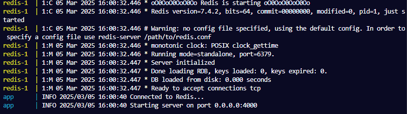

# 🚦Distributed Rate Limiter

A distributed rate limiter implemented in Go using the Token Bucket algorithm and Redis for storing tokens. This program runs in a Docker container, and is designed to handle bursts of requests efficiently while ensuring atomicity and scalability.

**Third-Party packages**

- The `httprouter` package is used for fast and efficient routing.
- The `alice` package is used for clear and readable middleware chaining.
- The `go-redis` is a Redis client for Go.
- The `toolkit` custom reusable module with logic commonly used in web development, such as logging, JSON handling, and error management.

---

## ⚙️ Features

- **Token Bucket Algorithm:** Handles bursts of requests by allowing a fixed number of tokens to be consumed within a time window.

- **Distributed:** Uses Redis as a centralized store for tokens, making it suitable for distributed systems.

- **Atomic Operations:** Ensures concurrent-safe operations using Lua scripting for Redis.

- **Performance:** The Lua script is loaded and cached on Redis' server, ensuring fast execution.

- **Modular Design:** Code is organized into reusable components for better maintainability.

- **Custom Toolkit:** Reduces code duplication by centralizing logging and utility functions.

---

## 🚦 Rate Limiter Middleware

Each client is identified by their IP address, and Redis key is created for each client:

```go
"rate_limit:<clientIP>"
```

Tokens are stored in Redis with an expiration time. Tokens are replenished based on the elapsed time since the last request:

```lua
math.floor(elapsed * max_tokens / expiration_in_micros)
```

The Lua script checks if enough tokens are available using `redis.call()`. If tokens are available, the request is allowed, otherwise, it is rejected.

---

## 🔍 Prerequisites

- Go 1.20+

- Redis 6.0+

- Redis connection secrets (Public endpoint: `REDIS_CONN_ADDRESS`, Password to the database: `REDIS_PASSWORD`)

## 🖥️ Run the program

- **Pull the docker image**

```bash
docker pull ghcr.io/kweeuhree/distributed-rate-limiter:latest
```

- **Copy `compose.yaml` from the repository into the folder with the docker image.**

- **Create the Secrets File**

Ensure the `redisSecrets.txt` file exists in the same directory as the compose.yaml, and contains the correct Redis connection endpoint and password.
Your file should look like so:

```go
REDIS_CONN_ADDRESS=redis-XXXXX.cXXX.us-centralX-X.gce.redns.redis-cloud.com:XXXXX;REDIS_PASSWORD=1234567890qwerty
```

- **Run the container:**

```bash
docker-compose up
```

Console output upon successful launch:

<p align="center">

</p>
---

## 📚 Challenges and learning

I started this project wanting to learn concurrency in Go a little better, as well as trying out a distributed solution for a common real-world problem, such as the necessity to limit the amount of requests a single user can make.

After finishing the initial Go implementation, I encountered the challenge of ensuring atomicity. Although combining Go transactions and `Exec()` method was a valid and working solution, it was bulky and less efficient. Originally, I resisted Lua scripting, because my primary focus was on learning Go. But at the same time I was committed to leveraging Redis for a distributed solution.

Redis clearly recommends Lua scripting when atomicity is concerned. So the final code is refactored to use a cached Lua script. Redis provides an option to load and cache a script, so it can be run on demand using a SHA string provided by Redis.

This approach not only ensures atomicity but also improves performance by reducing the number of calls to Redis. Instead of making multiple Redis calls, the program executes a single cached Lua script, which handles all the necessary logic in one atomic operation.
